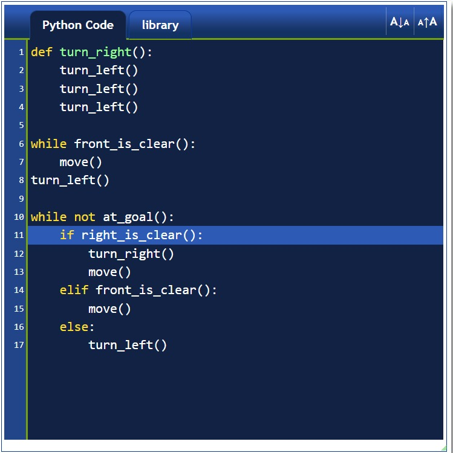
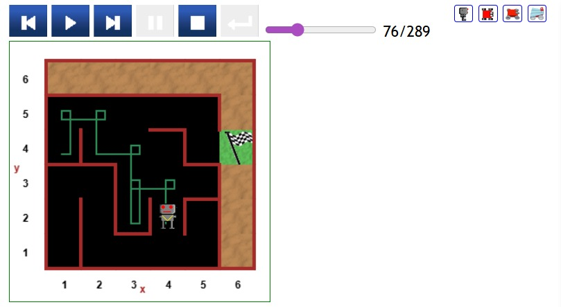

# 🧩 Day 06 – Escaping the Maze (Reeborg's World)

This project is part of my **100Days-100Projects Python Bootcamp**.  
In this challenge, Reeborg must escape a maze using logic-based movement rules.  
The code runs inside the **Reeborg's World** online simulator, not in a normal Python environment.

---

## 🌍 Project Description

Reeborg starts inside a maze and must find his way to the goal.  
Since the world has walls and turns, we use maze-solving logic such as:

- Checking if the path is clear  
- Following the right-hand rule  
- Turning left/right  
- Looping until Reeborg reaches the goal  

This exercise teaches **control flow**, **functions**, and **basic algorithms**.

---

## ▶️ How to Run the Code

1. Open Reeborg's World:  
   **https://reeborg.ca/reeborg.html**

2. Select a maze world:  
   `World → Select World → Maze`

3. Paste the code from `main.py` into the editor.

4. Click **Run** to see Reeborg escape the maze.

---

## 📁 Files in This Folder

| File | Description |
|------|-------------|
| `main.py` | Contains the Python logic used to solve the maze |
| `screenshot.png` | Screenshot of the maze in action |
| `README.md` | Documentation for this project |

---

## 📷 Screenshots

### 🧠 Maze Logic (Code Running)


### 🌀 Maze Layout (Reeborg's World)


## 🧠 Maze Solving Algorithm (Right-Hand Rule)

The core logic follows the rule:

> “If there's a path to the right, turn right and move.  
> If forward is clear, move.  
> Else, turn left.”

A simple and effective strategy for solving many mazes.

---

## 🧪 Example Code (from `main.py`)

```python
def turn_right():
    turn_left()
    turn_left()
    turn_left()

while front_is_clear():
    move()
turn_left()
    
while not at_goal():
    if right_is_clear():
        turn_right()
        move()
    elif front_is_clear():
        move()
    else:
        turn_left()
